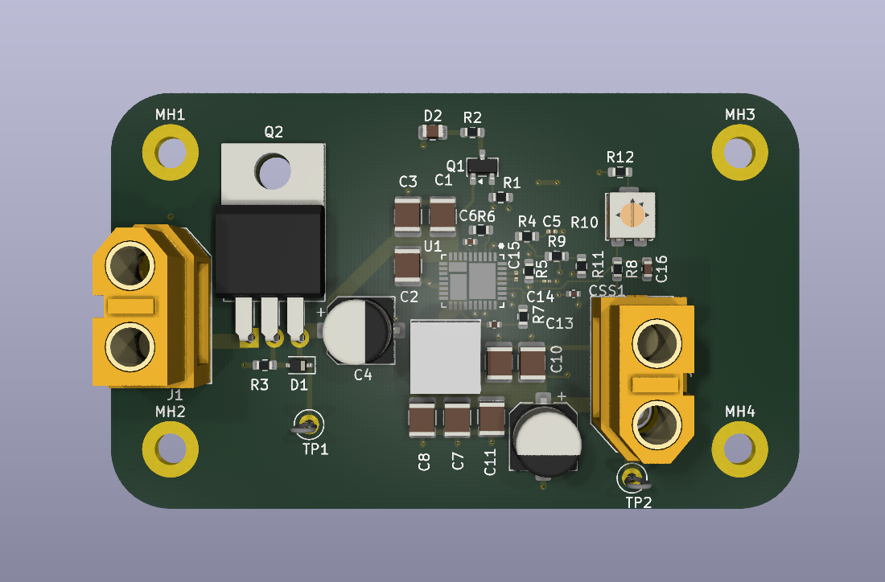
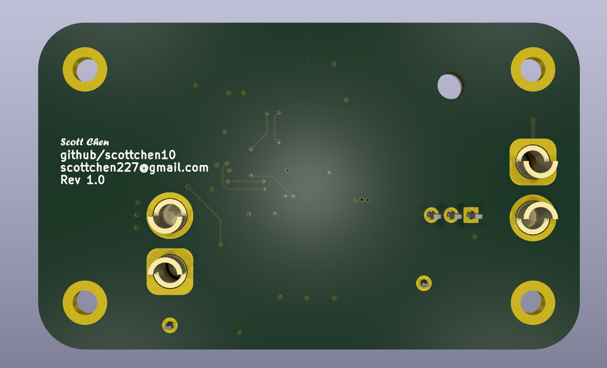
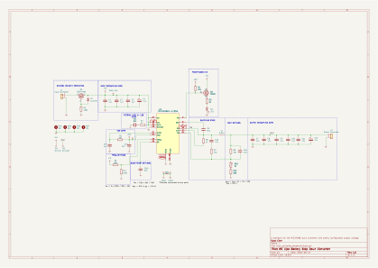
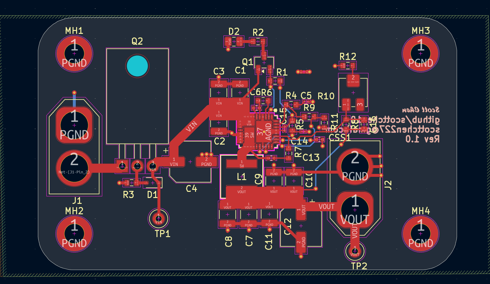
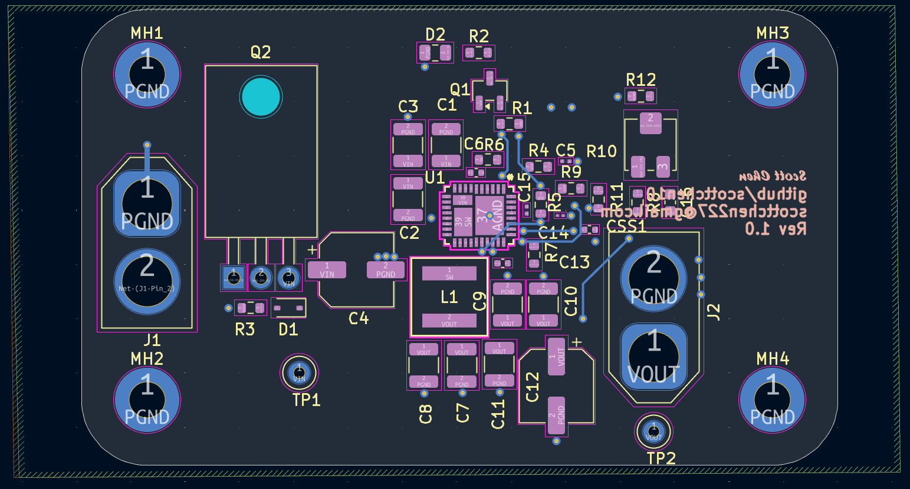

# MIC24066 Buck Converter Breakout

A simple breakout board for the Microchip MIC24066 synchronous buck converter designed in KiCad.

This was a learning project so there may be many improvements that are possible.

## 3D View

## Schematic

- [`MIC24066_Schematic.pdf`](docs/MIC24066_Schematic.pdf)

## PCB Layout

### Top Layer

### Bottom Layer

